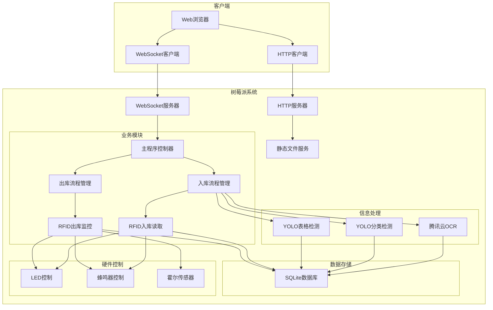
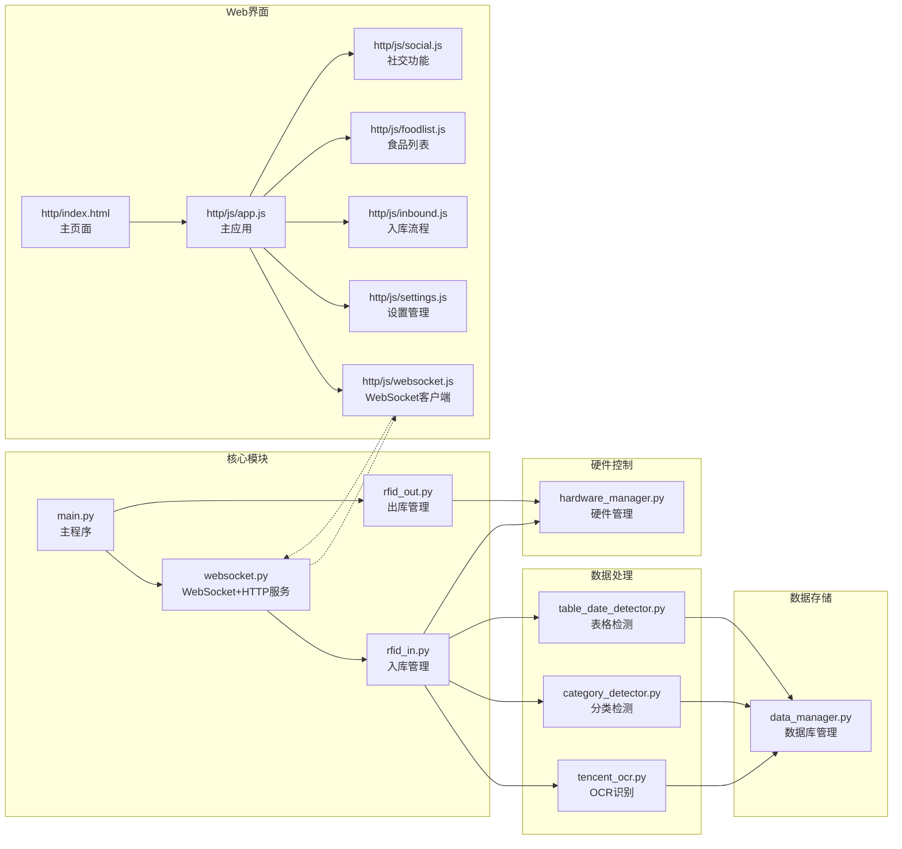
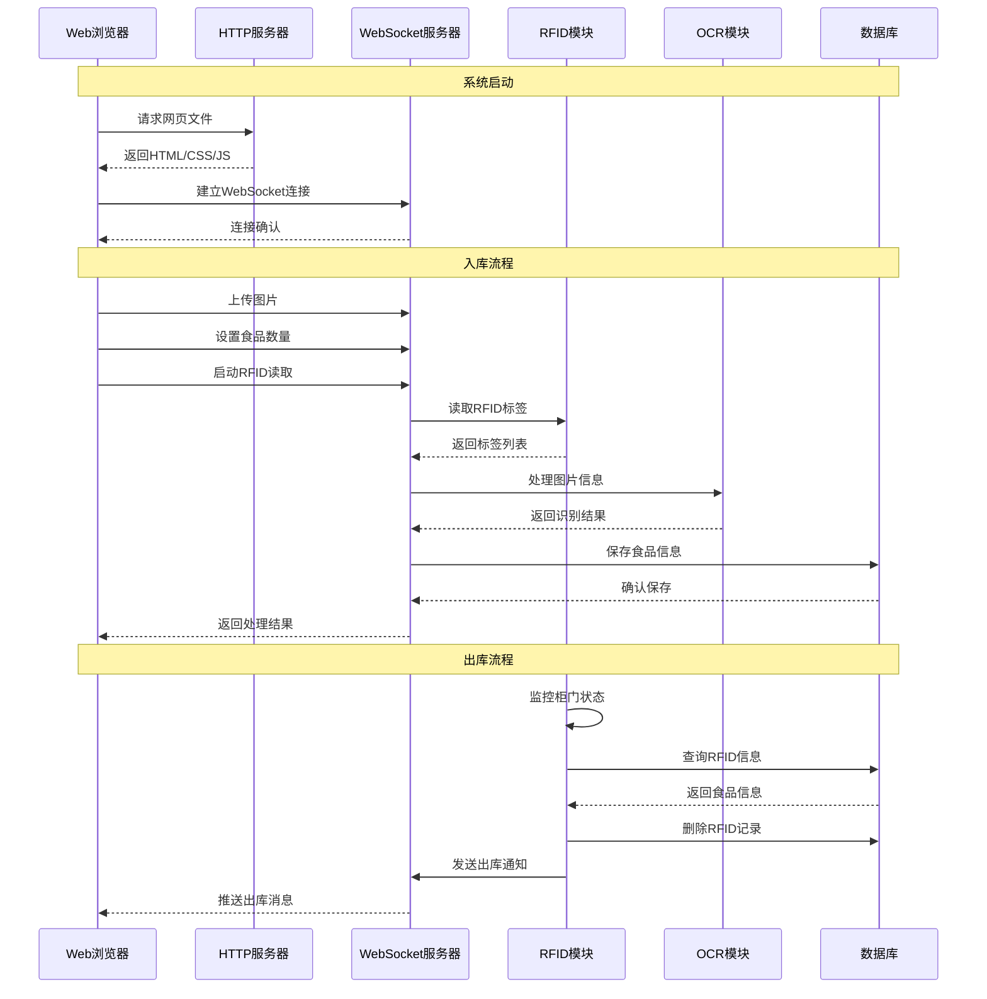
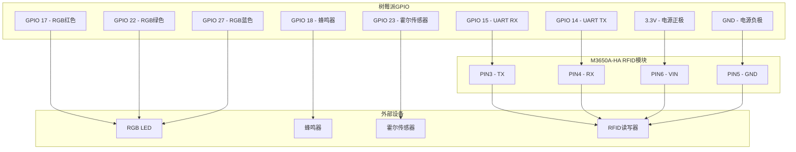

# 智能食品柜系统 (Smart Food Cabinet)

简易操作命令：
source sfc/bin/activate
cd /home/xyd/smart_food_cabinet
python main.py


[](https://www.python.org/)
[](https://www.raspberrypi.org/)

## 📖 项目简介

### 核心功能概述

智能食品柜系统是一个基于树莓派的智能食品管理系统，集成了以下核心功能：

- **🔍 OCR识别**: 使用腾讯云OCR服务识别食品包装信息
- **📡 RFID管理**: 支持RFID标签的入库读取和出库监控
- **🗄️ 数据库管理**: SQLite数据库存储食品信息
- **🌐 WebSocket通信**: 实时双向通信，支持手机端操作
- **💡 硬件控制**: LED指示灯、蜂鸣器、霍尔传感器控制
- **🤖 AI检测**: YOLO模型进行食品分类和表格日期检测
- **📱 Web界面**: 完整的移动端网页界面，支持入库、管理、社交（demo）等功能

### 技术栈介绍

- **后端**: Python 3.8+
- **前端**: HTML5, CSS3, JavaScript (ES6+)
- **数据库**: SQLite3
- **通信**: WebSocket (websockets库), HTTP (aiohttp)
- **AI模型**: YOLOv8 (ultralytics)
- **OCR服务**: 腾讯云OCR API
- **硬件控制**: RPi.GPIO
- **图像处理**: OpenCV, PIL
- **配置管理**: python-dotenv

### 项目亮点

- ✨ **模块化设计**: 清晰的模块分离，便于维护和扩展
- 🔄 **实时通信**: WebSocket实现手机端与树莓派实时交互
- 🎯 **智能识别**: 多模态AI识别（OCR + YOLO）
- 🛡️ **硬件反馈**: 完整的LED和蜂鸣器反馈系统
- 📊 **数据管理**: 完整的食品信息生命周期管理
- 🔧 **易于部署**: 一键安装脚本，简化部署流程

---

## 🏗️ 系统架构

### 整体架构图



### 模块关系图



### 数据流程图



### 硬件连接图



---

## 🔧 硬件要求

### 树莓派配置要求

| 组件 | 最低要求 | 推荐配置 | 实际配置 |
|------|----------|----------|----------|
| **处理器** | Raspberry Pi 3B+ | Raspberry Pi 4B (4GB+) | Raspberry Pi 4B |
| **内存** | 1GB | 4GB+ | 4GB |
| **存储** | 16GB microSD | 32GB+ microSD | 32GB microSD |
| **操作系统** | Raspberry Pi OS | Raspberry Pi OS (64-bit) | Raspberry Pi OS (64-bit) |
| **Python版本** | 3.8+ | 3.9+ | 3.11 |

### RFID读写器规格

- **型号**: M3650A-HA RFID读写器模块
- **接口**: UART串口 (TTL电平)
- **工作电压**: 直流 3.3V-5V
- **工作电流**: 小于 75mA
- **工作频率**: 13.56MHz
- **读取距离**: 标准白卡大于5cm (与标签尺寸和性能相关)
- **串口波特率**: 默认9600Bit/S (可设置)
- **支持标签**: Mafare 1 S50, Mafare 1 S70等
- **连接方式**: 通过UART (TX/RX) 直接连接树莓派GPIO
- **引脚定义**: 
  - PIN3 (TX): 数据发送
  - PIN4 (RX): 数据接收
  - PIN5 (GND): 电源负极
  - PIN6 (VIN): 电源正极 (3.3V-5V)
- **功能**: 自动读卡号、自动读指定数据块、命令操作等

### 硬件组件要求

#### 传感器
| 传感器 | 规格 | 连接方式 |
|--------|------|----------|
| **霍尔传感器** | HS-S40A | GPIO 23 (BCM编号) |
| | • 供电电压: 3.3V / 5V | |
| | • 引脚定义: G(GND), V(VCC), S(数字信号) | |

#### 执行器/输出设备
| 设备 | 规格 | 连接方式 |
|------|------|----------|
| **RGB LED** | 5V/3.3V | GPIO 17 (红色), GPIO 22 (绿色), GPIO 27 (蓝色) |
| **蜂鸣器** | 无源蜂鸣器 | GPIO 18 |

---

## 🚀 安装部署

### 环境准备

1. **更新系统**
```bash
sudo apt update && sudo apt upgrade -y
```

2. **安装Python依赖**
```bash
sudo apt install python3-pip python3-venv -y
```

3. **创建虚拟环境**
```bash
# 进入项目目录
cd /home/xyd/smart_food_cabinet

# 创建虚拟环境
python3 -m venv sfc
```

### 依赖安装

项目提供了自动化安装脚本，一键完成所有依赖安装：

```bash
# 激活虚拟环境
source sfc/bin/activate

# 运行安装脚本
chmod +x install_requirements.sh
./install_requirements.sh
```

---

## 📱 使用指南

### 系统启动

1. **进入项目目录并激活虚拟环境**
```bash
# 激活虚拟环境并进入项目目录
source sfc/bin/activate
cd /home/xyd/smart_food_cabinet
```

2. **启动主程序**
```bash
python main.py
```

3. **查看启动状态**
```
智能食品柜系统启动中...
数据库初始化成功
WebSocket服务器线程已启动
出库监控线程已启动
智能食品柜系统启动成功！
```

4. **系统命令**
系统启动后，可以在控制台中输入以下命令进行交互：

- **`status`** - 查看系统状态
  ```
  ========================================
  系统状态:
    运行状态: 运行中
    WebSocket和HTTP服务器: 运行中
    出库监控: 运行中
    数据库路径: sfc_database.db
    全局数据: 15 项
  ========================================
  ```

- **`help`** - 查看帮助信息
  ```
  ========================================
  可用命令:
    quit    - 退出程序
    status  - 显示系统状态
    help    - 显示此帮助信息
  ========================================
  ```

- **`quit`** - 安全退出系统
  - 停止WebSocket服务器
  - 停止出库监控线程
  - 保存数据库数据
  - 清理资源并安全退出

**使用说明**：
- 在控制台中直接输入命令并按回车即可执行
- 输入未知命令会提示使用 `help` 查看帮助
- 也可以使用 `Ctrl+C` 强制退出（不推荐）

### 入库操作流程

1. **Web界面操作**
   - 在手机浏览器中访问 `http://[树莓派IP]:8080`
   - 点击"点击入库"按钮
   - 上传食品包装照片（最多6张）
   - 输入食品数量（1-10）
   - 点击"下一步"

2. **RFID标签读取**
   - 系统自动启动RFID读取
   - LED绿灯亮起，等待标签
   - 依次将RFID标签靠近读取器，读取后将标签贴在食品上
   - 每读取到标签，蜂鸣器响一次
   - 读取完成后，LED绿灯闪烁3次

3. **信息处理**
   - 系统自动进行OCR识别
   - 执行食品分类检测
   - 检测表格和日期信息
   - 将数据保存到数据库

4. **完成入库**
   - Web界面显示处理结果
   - 3秒后自动返回首页

### 出库操作流程

1. **自动监控**
   - 系统持续监控柜门状态
   - LED全部关闭

2. **柜门打开**
   - 霍尔传感器检测到柜门打开
   - LED蓝灯亮起
   - RFID开始持续读取

3. **标签出库**
   - 将RFID标签靠近读取器
   - 系统查询数据库
   - 成功：蜂鸣器响一次，删除记录，Web界面自动更新
   - 失败：蜂鸣器长鸣，红灯闪烁

4. **柜门关闭**
   - 检测到柜门关闭
   - 停止RFID读取
   - LED关闭
   - Web界面显示出库通知


## 🌐 Web界面使用

### 访问方式

> **⚠️ 重要说明**: 目前系统仅支持局域网访问，客户端和服务器必须在同一局域网内才能正常通信。

#### 在树莓派上访问
- **网页地址**: `http://localhost:8080`

#### 在手机/电脑上访问
- **网页地址**: `http://[树莓派IP]:8080`
- **前提条件**: 确保设备与树莓派在同一局域网

例如：`http://183.172.187.250:8080`

### 页面功能详解

#### 1. 首页
- **功能**：应用主界面，显示通知和快捷操作
- **特点**：
  - 醒目的"点击入库"按钮
  - 通知卡片区域（支持滑动展示）
  - 过期食品提醒
  - 过敏原提醒
  - 社区回复通知

#### 2. 入库流程（5个步骤）

##### 2.1 数据准备页面
- **功能**：图片上传和数量设置
- **特点**：
  - 支持最多6张图片上传
  - 图片网格布局
  - 数量选择器（1-10）
  - "下一步"按钮

##### 2.2 RFID读取页面
- **功能**：RFID标签读取
- **特点**：
  - 扫描进度显示
  - 标签数量提示
  - 扫描状态指示
  - LED绿灯常亮，蜂鸣器反馈

##### 2.3 信息处理页面
- **功能**：数据处理和识别
- **特点**：
  - "数据处理中"状态显示
  - 进度指示器
  - 处理状态反馈
  - OCR识别和AI分类

##### 2.4 识别成功页面
- **功能**：入库成功提示
- **特点**：
  - 成功状态显示
  - 3秒倒计时
  - 自动跳转提示

##### 2.5 识别失败页面
- **功能**：入库失败提示
- **特点**：
  - 失败状态显示
  - 错误信息提示
  - 重新操作选项

#### 3. 食品列表页面
- **功能**：食品信息展示和管理
- **特点**：
  - 搜索框（支持模糊搜索）
  - 食品卡片列表
  - 可编辑字段（名称、净含量、生产日期、保质期、在库数量）
  - 过敏原标签（红色边框，仅显示用户设置的过敏原）
  - "查看详情"按钮

#### 4. 食品详情页面
- **功能**：食品详细信息展示
- **特点**：
  - 弹窗形式展示
  - 营养成分表
  - 产品图片展示
  - 点击屏幕任何位置关闭

#### 5. 社交界面
- **功能**：用户分享和互动
- **特点**：
  - 用户分享展示
  - 点赞、评论功能
  - "+"发布按钮

#### 6. 分享发布页面
- **功能**：发布分享内容
- **特点**：
  - 图片上传（最多4张）
  - 评分系统（5星制）
  - 多行文本输入
  - "提交"按钮

#### 7. 设置界面
- **功能**：应用设置和配置
- **特点**：
  - 用户信息管理
  - 过敏原设置（8种常见过敏原）
  - 废纸篓入口
  - 用户反馈入口
  - 退出确认对话框

#### 8. 废纸篓页面
- **功能**：已出库食品记录管理
- **特点**：
  - 已出库食品记录
  - 出库时间显示
  - 10天自动清理提示（目前未实现）

### 核心功能特性

#### 1. 过敏原标签系统
- 只在用户设置的过敏原中显示红色边框标签
- 实时更新，设置变更后立即生效
- 支持8种常见过敏原类型

#### 2. 可编辑字段功能
- 所有白色文字框（除查看详情按钮）都可直接编辑
- 失焦时自动保存到本地存储
- 视觉反馈优化，编辑时边框变绿

#### 3. 图片上传功能
- 数据准备页面支持最多6张图片上传
- 分享发布页面支持最多4张图片上传
- 支持相册选择和拍照功能

#### 4. 搜索功能
- 食品名称模糊搜索
- 实时搜索，输入时即时显示结果
- 支持清空搜索功能

#### 5. 通知卡片系统
- 支持左右滑动切换不同类型的通知
- 支持上下滑动查看更多通知内容
- 包含过期食品提醒、过敏原提醒、社区回复通知

#### 6. 出库通知
- 实时监控柜门状态
- 自动检测RFID标签
- 即时推送出库通知
- 自动更新食品列表

### 使用流程

#### 1. 系统启动
```bash
# 在树莓派上运行
python main.py
```

启动后你会看到：
```
智能食品柜WebSocket服务器已启动，监听端口 5001
HTTP服务器已启动，监听端口 8080
网页访问地址: http://0.0.0.0:8080
```

#### 2. 手机访问
1. **网络要求**: 确保手机和树莓派在同一局域网内
2. 在手机浏览器中输入：`http://树莓派IP:8080`
3. 系统会自动尝试连接WebSocket
4. 如果连接失败，可在设置页面手动输入正确的树莓派IP

> **注意**: 系统不支持跨网络访问，必须确保客户端和服务器在同一局域网内。

#### 3. 入库操作（Web界面）
1. **数据准备**：点击"点击入库"按钮
2. **上传图片**：选择最多6张食品图片
3. **设置数量**：输入食品数量（1-10）
4. **RFID读取**：系统自动启动RFID标签读取
5. **信息处理**：自动进行OCR识别和AI检测
6. **完成入库**：显示结果，3秒后自动返回

#### 4. 食品管理
- **搜索功能**：在食品列表页面搜索食品
- **编辑信息**：点击食品信息可直接编辑
- **过敏原标签**：自动显示匹配的过敏原标签
- **查看详情**：点击"查看详情"查看完整信息

#### 5. 社交功能
- **发布分享**：上传图片、评分、添加文字
- **查看动态**：浏览其他用户的分享
- **互动功能**：点赞、评论、回复

#### 6. 设置管理
- **过敏原设置**：选择个人过敏原，系统会标记相关食品
- **网络设置**：配置树莓派IP地址
- **废纸篓**：查看已删除的食品
- **用户反馈**：提交使用反馈

### 故障排除

#### 1. 网页无法访问
- 检查HTTP服务器是否启动（端口8080）
- 检查防火墙设置
- 确认IP地址正确

#### 2. WebSocket连接失败
- 检查WebSocket服务器是否启动（端口5001）
- **检查网络连接**: 确保客户端和服务器在同一局域网
- 在设置页面手动输入正确的树莓派IP
- 确认防火墙没有阻止5001端口

#### 3. 图片上传失败
- 检查images_tempt目录权限
- 检查磁盘空间
- 确认图片格式支持（jpg, png, jpeg等）

#### 4. 数据库错误
- 检查数据库文件权限
- 确认数据库路径正确
- 检查SQLite3安装

#### 5. 日志分析

##### 查看系统日志
```bash
# 查看实时日志
tail -f /var/log/syslog

# 查看Python程序日志
journalctl -u your_service_name -f
```

##### 调试模式
在 `config.env` 中设置：
```
DEBUG_MODE=true
LOG_LEVEL=DEBUG
```

#### 6. 性能优化

##### 内存优化
```bash
# 监控内存使用
free -h

# 清理缓存
sudo sync && sudo echo 3 > /proc/sys/vm/drop_caches
```

##### 网络优化
```bash
# 检查网络延迟
ping -c 4 8.8.8.8

# 检查端口占用
netstat -tulpn | grep :8080
netstat -tulpn | grep :5001
```

##### 存储优化
```bash
# 检查磁盘空间
df -h

# 清理临时文件
sudo apt autoremove
sudo apt autoclean
```

### 技术说明

---

## 📡 API文档

### WebSocket消息格式

所有WebSocket消息都遵循以下格式：

```json
{
    "type": "消息类型",
    "action": "操作结果",
    "data": {
        "具体数据": "值"
    },
    "timestamp": "2024-01-01T12:00:00.000000"
}
```

### 消息类型说明

#### 入库流程消息

| 消息类型 | 方向 | 说明 |
|----------|------|------|
| `inbound_food_number` | 手机→树莓派 | 设置食品数量 |
| `inbound_ready` | 手机→树莓派 | 准备完成检查 |
| `inbound_rfid_reading` | 手机→树莓派 | 启动RFID读取 |
| `inbound_rfid_result` | 树莓派→手机 | RFID读取结果 |
| `inbound_info_process` | 手机→树莓派 | 启动信息处理 |
| `inbound_upload_success` | 手机→树莓派 | 上传成功确认 |
| `inbound_end` | 手机→树莓派 | 入库结束 |

#### 出库流程消息

| 消息类型 | 方向 | 说明 |
|----------|------|------|
| `outbound_notification` | 树莓派→手机 | 出库通知 |
| `outbound_confirm` | 手机→树莓派 | 出库确认 |

### 状态码说明

| 状态 | 说明 |
|------|------|
| `connected` | 连接成功 |
| `ready` | 准备完成 |
| `rfid_reading` | RFID读取中 |
| `rfid_reading_success` | RFID读取成功 |
| `rfid_reading_timeout` | RFID读取超时 |
| `data_processing` | 数据处理中 |
| `data_ready` | 数据准备完成 |
| `complete` | 流程完成 |
| `success` | 操作成功 |
| `failed` | 操作失败 |

### 错误处理

```json
{
    "type": "error",
    "action": "error",
    "data": {
        "status": "error",
        "error_message": "具体错误信息"
    },
    "timestamp": "2024-01-01T12:00:00.000000"
}
```

### 示例代码

#### 设置食品数量
```javascript
ws.send(JSON.stringify({
    type: 'inbound_food_number',
    data: { food_number: 3 }
}));
```

#### 启动RFID读取
```javascript
ws.send(JSON.stringify({
    type: 'inbound_rfid_reading',
    data: {}
}));
```

#### 处理RFID结果
```javascript
ws.onmessage = function(event) {
    const message = JSON.parse(event.data);
    
    if (message.type === 'inbound_rfid_result') {
        if (message.action === 'success') {
            console.log('RFID读取成功:', message.data.rfid_list);
        } else if (message.action === 'timeout') {
            console.log('RFID读取超时:', message.data.tag_count);
        }
    }
};
```

---

## 🧪 测试指南

### 环境准备
```bash
# 激活虚拟环境并进入目录
source sfc/bin/activate
cd /home/xyd/smart_food_cabinet
```

### 测试分类

#### 1. 模块功能测试
项目中的每个模块都提供了独立的测试功能，可以通过运行各模块的main函数来测试特定功能。

#### 2. Web服务器测试
测试HTTP服务器和WebSocket服务器的启动和运行。

#### 3. WebSocket通信测试
测试树莓派和客户端之间的WebSocket通信功能。

#### 4. 完整流程测试
测试整个系统的端到端功能。

### 1. 模块功能测试

#### 1.1 数据库模块测试

```bash
# 测试数据库管理功能
python modules/database/data_manager.py
```

**测试内容**:
- 数据库创建和表结构
- 食品信息保存
- RFID ID查询
- 数据删除和更新
- 同步状态标记

**预期输出**:
```
🚀 开始测试数据库管理器...
📝 测试1: 保存食品信息
✅ 食品信息保存成功，ID: 1
🔍 测试2: 根据RFID ID查询食品ID
✅ 查询成功，食品ID: 1
🔄 测试3: 标记为已同步
✅ 标记为已同步成功，ID: 1
🗑️ 测试4: 删除特定RFID ID
✅ 删除RFID ID '1372' 成功，食品ID: 1
🔍 测试5: 验证删除后的状态
✅ 删除验证成功，无法查询到已删除的RFID ID
```

#### 1.2 RFID入库模块测试

```bash
# 测试RFID入库功能
python modules/rfid/rfid_in.py
```

**测试内容**:
- RFID连接初始化
- 自动读卡模式设置
- 多标签批量读取
- LED和蜂鸣器反馈
- 标签数据收集

**测试步骤**:
1. 观察控制台输出连接状态
2. 准备多个不同的RFID标签
3. 依次将标签靠近读取器
4. 观察LED和蜂鸣器反馈
5. 查看最终读取结果

**预期输出**:
```
RFID读取器初始化完成
RFID串口连接初始化完成，端口: /dev/ttyUSB0
RFID读取器连接成功
开始读取3个不同标签，超时时间180.0秒
自动读卡号模式设置成功
收集到新标签 1/3: ABC123
收集到新标签 2/3: DEF456
收集到新标签 3/3: GHI789
读取完成
读取结果: {'success': True, 'tag_count': 3, 'rfid_list': 'ABC123,DEF456,GHI789'}
```

#### 1.3 RFID出库模块测试

```bash
# 测试RFID出库功能
python modules/rfid/rfid_out.py
```

**测试内容**:
- 出库监控启动
- 霍尔传感器监控
- 柜门状态检测
- RFID持续读取
- 数据库查询和删除
- WebSocket通知

**测试步骤**:
1. 启动测试，观察LED蓝灯亮起
2. 模拟柜门打开（触发霍尔传感器）
3. 将RFID标签靠近读取器
4. 观察成功/失败的硬件反馈
5. 模拟柜门关闭
6. 按Ctrl+C停止测试

**预期输出**:
```
RFID出库管理器初始化完成
启动出库监控流程
出库监控已启动，LED全部关闭
检测到柜门打开，启动出库流程
LED蓝灯亮起，RFID持续读取已启动
处理RFID标签: ABC123
成功找到食品，RFID: ABC123, 食品ID: 1
RFID ID ABC123 删除成功，食品ID: 1
检测到柜门关闭，停止出库流程
RFID持续读取已停止
LED全部关闭
```

#### 1.4 硬件管理模块测试

```bash
# 测试硬件控制功能
python modules/hardware/hardware_manager.py
```

**测试内容**:
- LED控制（绿灯、红灯）
- 蜂鸣器控制（短鸣、长鸣）
- 霍尔传感器监控
- GPIO资源管理

**测试步骤**:
1. 观察LED测试（绿灯、红灯、蓝灯各亮2秒，然后闪烁测试）
2. 听蜂鸣器测试（短鸣、长鸣、多种蜂鸣模式）
3. 观察霍尔传感器监控（持续30秒）
4. 手动触发门状态变化
5. 查看控制台输出

**预期输出**:
```
🔧 硬件管理器测试开始...
==================================================
💡 测试LED控制...
  🟢 绿灯测试...
  🔴 红灯测试...
  🔵 蓝灯测试...
  🟢 绿灯闪烁测试...
  🔴 红灯闪烁测试...
✅ LED测试完成

🔊 测试蜂鸣器控制...
  🔊 短鸣测试...
  🔊 长鸣测试...
  🔊 成功模式测试 (短-短-长)...
  🔊 警告模式测试 (长-短-长)...
  🔊 错误模式测试 (短-短-短)...
✅ 蜂鸣器测试完成

🚪 测试霍尔传感器...
  当前门状态: 关
  开始监控门状态变化...
  💡 请手动开关门来测试霍尔传感器
  💡 按 Ctrl+C 停止测试
  [14:30:25] 门状态变化: 开
  [14:30:26] 门状态变化: 关
✅ 霍尔传感器测试完成
✅ 硬件管理器测试结束
```

#### 1.5 OCR识别模块测试

```bash
# 测试腾讯云OCR功能
python modules/info_processor/tencent_ocr.py
```

**测试内容**:
- 腾讯云OCR API调用
- 图片预处理
- 文字识别和信息提取
- 数据映射和存储

**测试步骤**:
1. 确保config.env中配置了腾讯云密钥
2. 在images_tempt目录放置测试图片
3. 运行测试脚本
4. 观察识别结果和数据存储

**预期输出**:
```
腾讯云OCR处理器初始化完成
开始处理图片: test_image.jpg
OCR识别成功
提取到信息: {'name': '蒙牛纯牛奶', 'net_value': 250, 'net_unit': 'ml'}
数据已存储到db_data_list
```

#### 1.6 食品分类检测模块测试

```bash
# 测试YOLO食品分类功能
python modules/info_processor/category_detector.py
```

**测试内容**:
- YOLO模型加载
- 图片预处理
- 食品和饮品检测
- 分类结果统计

**测试步骤**:
1. 确保模型文件存在
2. 在images_tempt目录放置食品图片
3. 运行测试脚本
4. 观察检测结果和分类统计

**预期输出**:
```
模型加载成功: models/yolo_category_detector.pt
开始分析images_tempt文件夹中的图片...
处理第 1/3 张图片
检测结果: 食品: 2, 饮品: 0
处理第 2/3 张图片
检测结果: 食品: 1, 饮品: 1
分析完成！统计结果:
食品对象总数: 3
饮品对象总数: 1
结论: food (食品数量更多: 3 > 1)
```

#### 1.7 表格日期检测模块测试

```bash
# 测试YOLO表格日期检测功能
python modules/info_processor/table_date_detector.py
```

**测试内容**:
- YOLO模型加载
- 表格和日期检测
- 结果可视化
- 图片保存

**测试步骤**:
1. 确保模型文件存在
2. 在images_tempt目录放置包含表格的图片
3. 运行测试脚本
4. 查看检测结果和保存的图片

**预期输出**:
```
模型加载成功: models/yolo_table_date_detector.pt
开始批量检测...
处理第 1/3 张图片
检测结果: 2 个对象 (日期: 1, 营养成分表: 1)
结果已保存到: images_return/detection_result_01_test.png
批量检测完成！总体统计:
总检测对象数: 5
日期对象总数: 2
营养成分表对象总数: 3
```

### 2. Web服务器测试

#### 2.1 完整Web服务器测试

```bash
# 测试HTTP和WebSocket服务器
python test_documents/web网站测试文件/test_web_server.py
```

**测试内容**:
- HTTP服务器启动（端口8080）
- WebSocket服务器启动（端口5001）
- 网页文件服务
- 服务器正常运行

**预期输出**:
```
正在启动WebSocket和HTTP服务器...
WebSocket服务器端口: 5001
HTTP服务器端口: 8080
网页访问地址: http://localhost:8080
按 Ctrl+C 停止服务器
```

#### 2.2 仅HTTP服务器测试

```bash
# 测试仅HTTP服务器（适用于非树莓派环境）
python test_documents/web网站测试文件/test_web_only.py
```

**测试内容**:
- HTTP服务器启动（端口8080）
- 静态文件服务
- 网页访问测试

**适用场景**:
- 在Mac等非树莓派环境测试网页功能
- 不需要WebSocket通信的测试

### 3. WebSocket通信测试

#### 3.1 服务器端测试

```bash
# 在树莓派上启动WebSocket服务器
python test_documents/websocket测试文件/server.py
```

**测试内容**:
- WebSocket服务器启动
- 监听端口5001
- 等待客户端连接

#### 3.2 客户端测试

```bash
# 在客户端（Mac）上运行测试
python test_documents/websocket测试文件/client.py
```

**测试内容**:
- 连接测试
- 心跳测试（ping/pong）
- 请求响应测试
- 广播测试
- 定期广播测试
- 断开连接测试

**测试模式**:
- 自动测试：运行所有测试用例
- 交互式测试：手动输入命令测试

**修改IP地址**:
在 `client.py` 中修改树莓派IP：
```python
server_ip = "183.172.187.250"  # 修改为实际IP
```

### 4. 完整流程测试

1. **启动主程序**
```bash
python main.py
```

2. **测试入库流程**
   - 使用WebSocket客户端连接
   - 发送入库相关消息
   - 观察各模块协同工作

3. **测试出库流程**
   - 手动触发霍尔传感器
   - 测试RFID标签读取
   - 验证数据库操作
