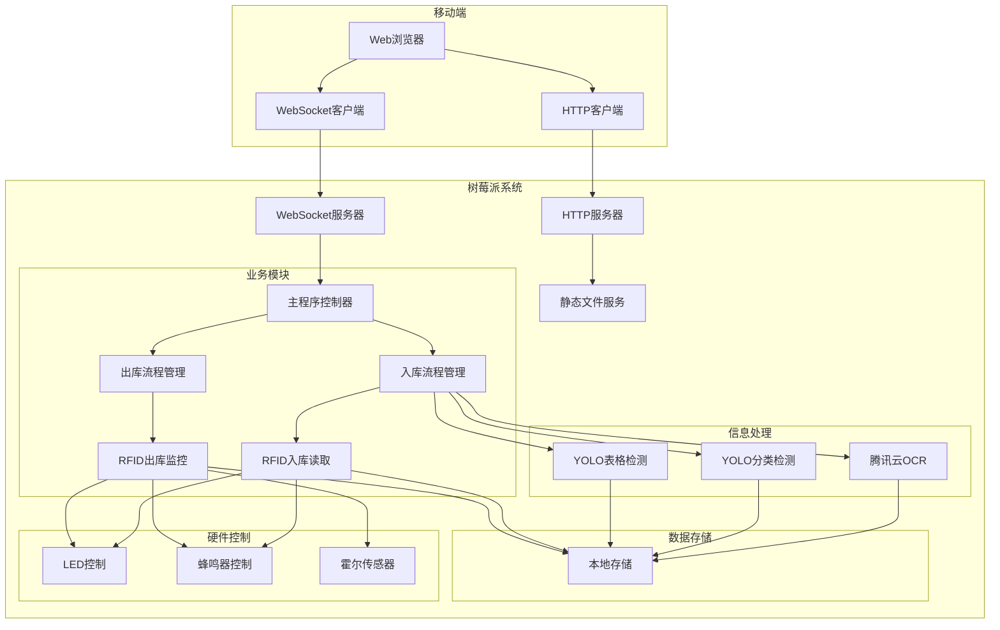
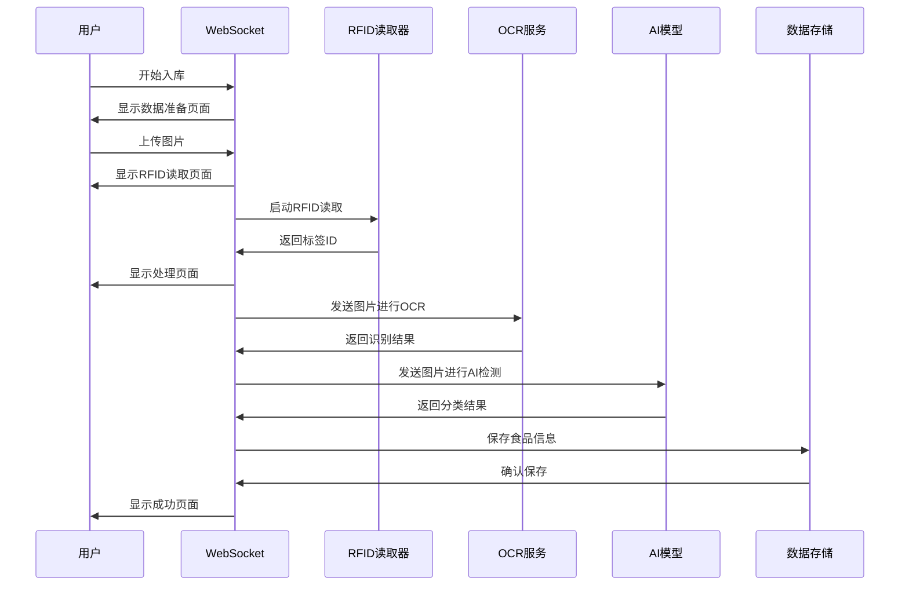
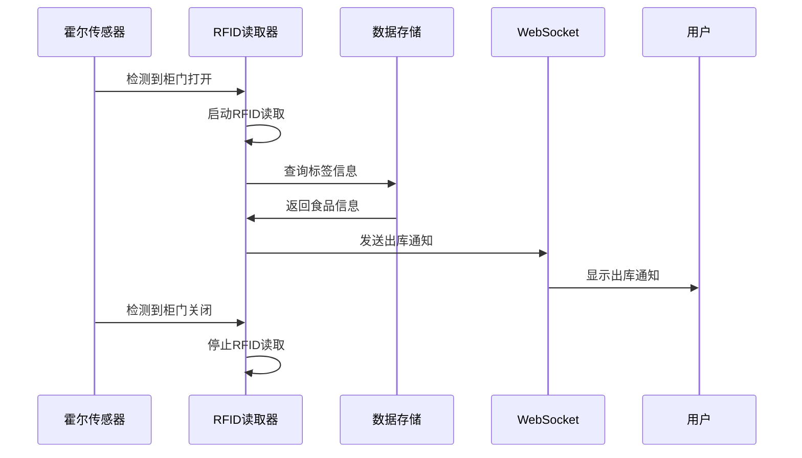

# 智能食品柜系统 (Smart Food Cabinet)

简易操作命令：
source sfc/bin/activate
cd /home/xyd/smart_food_cabinet
python main.py

[](https://www.python.org/)
[](https://www.raspberrypi.org/)

## 📖 项目简介

智能食品柜系统是一个基于树莓派的智能食品管理系统，集成了OCR识别、RFID管理、AI检测、WebSocket通信等先进技术，为用户提供完整的食品管理解决方案。

### 核心功能

- **🔍 智能识别**: 腾讯云OCR + YOLO AI模型，自动识别食品信息
- **📡 RFID管理**: 支持RFID标签的入库读取和出库监控
- **🗄️ 数据管理**: 基于本地存储的食品信息管理
- **🌐 实时通信**: WebSocket实现手机端与树莓派实时交互
- **💡 硬件反馈**: LED指示灯、蜂鸣器、霍尔传感器控制
- **📱 移动界面**: 完整的移动端网页界面，支持入库、管理等功能
- **👥 饮食日记功能**: 用户日记、点赞、评论等

### 技术栈

- **后端**: Python 3.8+, WebSocket, HTTP服务器
- **前端**: HTML5, CSS3, JavaScript (ES6+)
- **AI模型**: YOLOv8 (ultralytics)
- **OCR服务**: 腾讯云OCR API
- **硬件控制**: RPi.GPIO, 串口通信
- **图像处理**: OpenCV, PIL
- **配置管理**: python-dotenv

---

## 🏗️ 系统架构

### 整体架构



### 模块结构

```
smart_food_cabinet/
├── main.py                          # 主程序入口
├── config.py                        # 配置管理
├── config.env                       # 环境配置
├── requirements.txt                 # 依赖包
├── install_requirements.sh          # 安装脚本
├── modules/                         # 核心模块
│   ├── websocket/                   # WebSocket通信
│   │   └── websocket.py            # WebSocket服务器
│   ├── rfid/                        # RFID管理
│   │   ├── rfid_in.py              # 入库读取
│   │   ├── rfid_out.py             # 出库监控
│   │   └── rfid_manager.py         # RFID管理器
│   ├── info_processor/              # 信息处理
│   │   ├── tencent_ocr.py          # OCR识别
│   │   ├── category_detector.py    # 分类检测
│   │   ├── table_date_detector.py  # 表格检测
│   │   └── field_mapper.py         # 字段映射
│   ├── hardware/                    # 硬件控制
│   │   └── hardware_manager.py     # 硬件管理器
│   └── database/                    # 数据管理
│       └── data_manager.py         # 数据管理器
├── http/                            # Web界面
│   ├── index.html                   # 主页面
│   ├── css/style.css               # 样式文件
│   └── js/                         # JavaScript模块
│       ├── app.js                  # 主应用
│       ├── websocket.js            # WebSocket客户端
│       ├── pages.js                # 页面管理
│       ├── inbound.js              # 入库流程
│       ├── foodlist.js             # 食品列表
│       ├── social.js               # 社交功能
│       └── settings.js             # 设置管理
└── models/                          # AI模型
    ├── yolo_category_detector.pt   # 分类检测模型
    └── yolo_table_date_detector.pt # 表格检测模型
```

---

## 🚀 快速开始

### 环境要求

- **硬件**: 树莓派 4B (推荐)
- **系统**: Raspberry Pi OS
- **Python**: 3.8+
- **存储**: 至少8GB SD卡

### 安装步骤

1. **下载项目**
```bash
# 下载项目压缩包
wget https://github.com/spacinnnng/smart-food-cabinet/blob/main/smart_food_cabinet.zip

# 解压项目
unzip smart_food_cabinet.zip
cd smart_food_cabinet
```

2. **一键安装**
```bash
chmod +x install_requirements.sh
./install_requirements.sh
```

3. **配置环境**
```bash
# 编辑配置文件（根据需要修改）
nano config.env
```

4. **启动系统**
```bash
# 激活虚拟环境
source sfc/bin/activate

# 启动主程序
python main.py
```

### 配置说明

在 `config.env` 文件中配置以下参数：

```env
# 腾讯云OCR配置
SECRET_ID=your_secret_id
SECRET_KEY=your_secret_key
OCR_ENDPOINT=ocr.tencentcloudapi.com

# 服务器配置
WEB_API_HOST=0.0.0.0
WEB_API_PORT=8080
WEBSOCKET_PORT=5001

# RFID配置
RFID_PORT=/dev/ttyS0
RFID_TIMEOUT=5

# 调试模式
DEBUG_MODE=false
```

---

## 📱 用户界面

### 主要页面

#### 1. 首页
- **功能**: 系统状态显示、入库操作入口
- **特点**: 
  - 连接状态指示器
  - 入库按钮
  - 通知卡片展示

#### 2. 入库流程
- **数据准备**: 图片上传（最多6张）、数量设置
- **RFID读取**: 扫描RFID标签
- **信息处理**: OCR识别和AI分类
- **结果展示**: 成功/失败状态

#### 3. 食品列表
- **功能**: 食品信息展示和管理
- **特点**:
  - 搜索功能
  - 可编辑字段
  - 过敏原标签
  - 详情查看

#### 4. 饮食日记界面
- **功能**: 用户记录饮食日记
- **特点**:
  - 记录饮食日记
  - 收藏
  - 评论

#### 5. 设置界面
- **功能**: 应用配置
- **特点**:
  - 用户信息管理
  - 过敏原设置
  - 废纸篓管理

### 核心特性

#### 过敏原标签系统
- 支持8种常见过敏原
- 提醒重点标识
- 实时更新

#### 可编辑字段
- 所有白色文字框可直接编辑
- 失焦自动保存
- 视觉反馈优化

#### 图片处理
- 支持拍照或导入
- 自动压缩优化

---

## 🔧 开发指南

### 项目结构说明

#### 后端模块

**主程序 (`main.py`)**
- 系统启动入口
- 模块协调管理
- 硬件监控线程

**WebSocket服务器 (`modules/websocket/websocket.py`)**
- 实时双向通信
- 消息路由处理
- 连接管理

**RFID管理 (`modules/rfid/`)**
- `rfid_in.py`: 入库读取流程
- `rfid_out.py`: 出库监控流程
- `rfid_manager.py`: RFID基础功能

**信息处理 (`modules/info_processor/`)**
- `tencent_ocr.py`: OCR识别服务
- `category_detector.py`: 食品分类检测
- `table_date_detector.py`: 表格日期检测
- `field_mapper.py`: 字段映射转换

**硬件控制 (`modules/hardware/hardware_manager.py`)**
- LED指示灯控制
- 蜂鸣器控制
- 霍尔传感器监控

#### 前端模块

**主应用 (`http/js/app.js`)**
- 应用状态管理
- 用户数据管理
- 通知系统

**WebSocket客户端 (`http/js/websocket.js`)**
- 连接管理
- 消息处理
- 重连机制

**页面管理 (`http/js/pages.js`)**
- 页面切换
- 导航管理
- 内容加载

**功能模块**
- `inbound.js`: 入库流程控制
- `foodlist.js`: 食品列表管理
- `social.js`: 社交功能
- `settings.js`: 设置管理


### 调试模式

启用调试模式查看详细日志：
```bash
# 设置环境变量
export DEBUG_MODE=true

# 或修改config.env
DEBUG_MODE=true
```

---

## 🔄 工作流程

### 入库流程



### 出库流程



---

## 🛠️ 硬件配置

### 硬件清单

- **树莓派 4B**: 主控制器
- **RFID读取器**: USB串口设备
- **LED指示灯**: 红、绿、蓝三色
- **蜂鸣器**: 声音反馈
- **霍尔传感器**: 柜门状态检测

### 硬件连接

```
树莓派 GPIO 连接:
- LED红灯: GPIO 18
- LED绿灯: GPIO 23  
- LED蓝灯: GPIO 24
- 蜂鸣器: GPIO 25
- 霍尔传感器: GPIO 4
```

### RFID配置

```python
# RFID串口配置
RFID_PORT = "/dev/ttyUSB0"  # 串口设备
RFID_BAUDRATE = 9600        # 波特率
RFID_TIMEOUT = 5            # 超时时间
```

---

## 📊 数据管理

### 数据结构

#### 食品信息
```json
{
  "food_id": 1,
  "name": "食品名称",
  "net_content": "500g",
  "production_date": "2024-01-01",
  "expire_date": "2024-12-31",
  "shelf_life": "12个月",
  "category": "零食",
  "allergens": ["牛奶", "坚果"],
  "image": "base64_image_data",
  "detail_images": ["image1", "image2"],
  "quantity": 5,
  "created_at": "2024-01-01T00:00:00Z"
}
```

#### 用户设置
```json
{
  "userName": "用户名",
  "userAvatar": "头像路径",
  "userAllergens": ["牛奶", "坚果", "鸡蛋"],
  "notifications": []
}
```

### 存储策略

- **本地存储**: 使用localStorage存储用户数据
- **图片处理**: 自动压缩，限制文件大小
- **数据同步**: WebSocket实时同步
- **备份机制**: 定期数据备份

---

## 🔒 安全与隐私

### 数据安全
- 本地数据存储，不上传云端
- 图片自动压缩，保护隐私
- 敏感信息加密存储

### 网络安全
- WebSocket连接加密
- 输入数据验证
- 防止XSS攻击

---

## 🐛 故障排除

### 常见问题

#### 1. WebSocket连接失败
```bash
# 检查网络连接
ping <树莓派IP>

# 检查端口是否开放
telnet <树莓派IP> 5001
```

#### 2. RFID读取失败
```bash
# 检查串口设备
ls /dev/ttyUSB*

# 检查权限
sudo chmod 666 /dev/ttyUSB0
```

#### 3. OCR识别失败
```bash
# 检查腾讯云配置
cat config.env | grep SECRET

# 检查网络连接
curl -I https://ocr.tencentcloudapi.com
```

#### 4. 硬件控制失败
```bash
# 检查GPIO权限
sudo usermod -a -G gpio $USER

# 重启服务
sudo systemctl restart smart-food-cabinet
```

---

## 🧪 测试指南

```bash
# 运行测试
python -m pytest tests/

# 代码检查
flake8 modules/
pylint modules/
```

---

## 📞 联系方式

- **项目维护者**: 肖雅迪
- **项目地址**: https://github.com/spacinnnng/smart-food-cabinet

---

## 🙏 致谢
感谢队友！！！
感谢以下开源项目和服务：
- [腾讯云OCR](https://cloud.tencent.com/product/ocr) - 文字识别服务
- [YOLOv8](https://github.com/ultralytics/ultralytics) - 目标检测模型
- [WebSockets](https://websockets.readthedocs.io/) - WebSocket通信库
- [Raspberry Pi](https://www.raspberrypi.org/) - 硬件平台

---